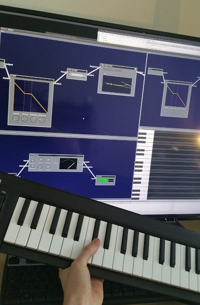

# Elastic IDE
An IDE for audio, create sounds and music programming with nodes.

## Goals
- Learn to build and understand everything from UI-design, user interaction methods and go deep into math (wave physics, execution speed optimalizations)
- Node-based audio-programming
- Build instruments and create a score by putting them together and automate with MIDI
- vim-inspired way of adding and configuring nodes
  - Mouse not required for use
- Dynamic compilation of music project
    - Using LLVM and Clang to compile synths in project to native hardware instructions for very fast execution
        - Not limited by the HotSpot JVM performance and garbage collection
- Possibility to export projects to WebAssembly for easy use on the web (e.g build your own customized game audio engine), controllable from JavaScript
    - Export to embedded devices too (MicroChip PIC?), as C-code, using their own C compiler afterwards
- Dependencies, create a library of sounds and synths, and easily link or append them into current project for re-use

## Current state
There is a lot of work left, project being a bit rough around the edges, feeling much like an alpha-version product.

## Images
### Typical workbench with physical MIDI keyboard connected

### A design sketch

